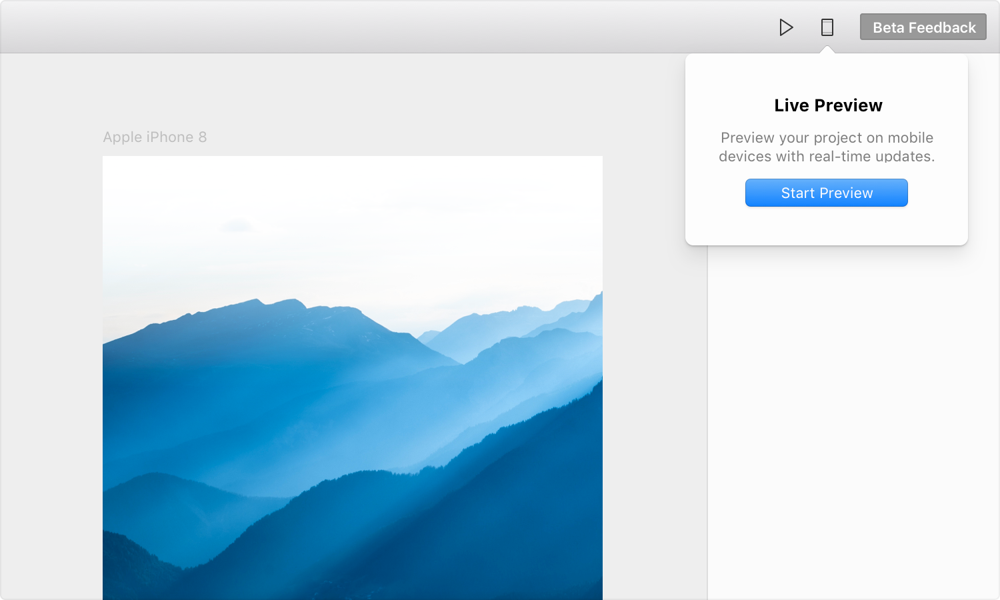

# Live Preview

Framer X Beta 3 introduces Live Previewing. This adds the ability to preview your projects in a browser, and on mobile devices, with real-time updates. You can also share this link with others, and they will be able to follow along with all of your changes. They’ll see your visual edits as they occur, plus they will be able to interact with your prototype.

* **Live** – The remote preview updates with your changes in real-time, ideal for designing on-device interactions.
* **Shareable** — The generated link can be shared with anyone, working on any \(corporate\) network from anywhere in the world.
* **Security** — The generated link will automatically become inaccessible once your project is closed or if you stop the live preview manually. None of your project files are stored, everything is served from your computer.
* **Mobile** — Simply scan the QR code with the Camera app to open the project.

## Start Previewing

To start the live preview, click on the mobile phone icon in the top-right corner. Click "Start Preview" from within the popover. This will start the live server. From here on out, you can either scan the QR code with the Camera app on your iOS device, or click "Open in Browser" to preview in your browser.

## Notes

We’re actively working on improving the live previewing experience, as we continue testing it as part of the Beta. Find a list of known issues we’re tackling below.

* **Loading** — It may take a few seconds to connect to the server.
* **Performance** — If you have Low Power Mode enabled on iOS, the animations will be throttled to 30FPS.
* **Previewing Experience** — The generated link now automatically opens in a browser on mobile. We’ll update our mobile apps to detect these links, so we can automatically open them in full-screen after scanning the QR code.
* **Fonts** — You’ll only be able to preview typefaces that are installed locally on your mobile device \(system fonts\).

